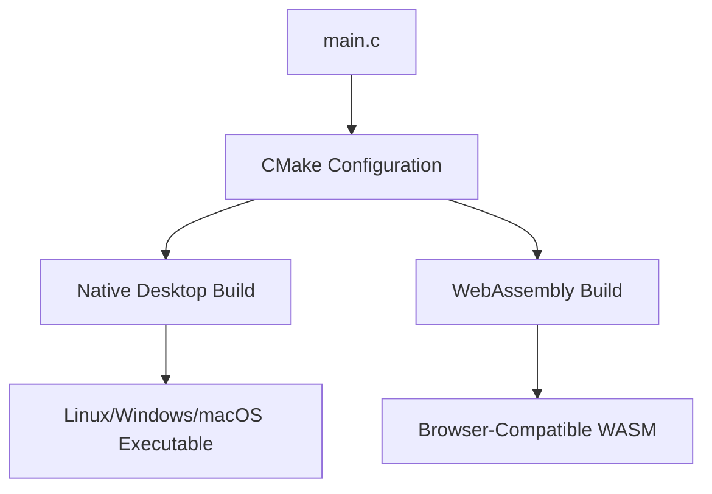

# 🎮 Project Overview: Modern C Done Right

Welcome to a showcase of what modern C development looks like in 2024! This project demonstrates professional-grade practices that many C tutorials skip.

## 🌟 What Makes This Project Special?

### 🏗️ **Professional Build Architecture**

Unlike simple "compile with gcc" tutorials, this project uses:

```
Project Structure:
├── main.c                 # Clean, readable C code
├── CMakeLists.txt         # Modern build configuration
├── conanfile.txt          # Dependency management
├── build-common.sh        # Shared utilities (DRY principle)
├── build-native.sh        # Desktop compilation
├── build-wasm.sh          # WebAssembly compilation
├── watch.sh               # Development workflow
└── cleanup.sh             # Project maintenance
```

**Why this matters:** Real C projects aren't single files. This structure scales from small demos to enterprise applications.

### ⚡ **Performance-First Design**

**The Challenge:** Animate 2,500+ objects at 60fps
**The Solution:** Efficient C with optimized algorithms

```c
// Not just "Hello World" - real performance constraints
#define NUM_BALLS 2500
#define TARGET_FPS 60

// Optimized update loop
for (int i = 0; i < NUM_BALLS; i++) {
    UpdateBall(&balls[i], SCREEN_WIDTH, SCREEN_HEIGHT);
}
```

**Result:** Smooth animation that would struggle in higher-level languages.

### 🌐 **True Cross-Platform Development**

**One Codebase, Multiple Targets:**



**Why this is remarkable:** The exact same C code runs natively AND in web browsers without modification.

## 🎯 Learning Objectives

By studying this project, you'll master:

### 🔧 **Modern C Toolchain**
- **CMake:** Industry-standard build system
- **Conan:** Package management for C/C++
- **Cross-compilation:** One source, multiple targets
- **Professional workflows:** Automated builds and testing

### 🎮 **Graphics Programming Fundamentals**
- **Real-time rendering:** 60fps constraint programming
- **Game loop architecture:** Update/Draw separation
- **Memory management:** Efficient array handling
- **Physics simulation:** Collision detection and response

### 🌐 **WebAssembly Development**
- **Emscripten toolchain:** C to JavaScript/WASM compilation
- **Browser integration:** HTML5 Canvas with C backend
- **Performance optimization:** WASM-specific considerations

### 🚀 **Professional Practices**
- **Code organization:** Clean, maintainable structure
- **Build automation:** Scripts that handle complexity
- **Error handling:** Robust compilation workflows
- **Documentation:** Self-documenting code and scripts

## 🏆 Project Highlights

### 📊 **Performance Metrics**
- **2,500 simultaneous objects** - Real performance testing
- **60 FPS target** - Industry-standard frame rate
- **Sub-millisecond updates** - Efficient algorithms
- **Cross-platform consistency** - Same performance everywhere

### 🎨 **Visual Features**
- **Dynamic colors** - 17 different ball colors
- **Realistic physics** - Collision detection and response
- **Smooth animation** - Interpolated movement
- **Responsive design** - Scales to window size

### 🔧 **Developer Experience**
- **One-command builds** - `./build-native.sh`
- **Auto-rebuild workflow** - `./watch.sh`
- **Easy experimentation** - Modify constants and see results
- **Clean project management** - `./cleanup.sh`

## 🤔 Why C for Graphics?

**Common Question:** "Why not use Unity, Unreal, or JavaScript?"

**The Answer:** Understanding the fundamentals gives you superpowers:

### 🚀 **Performance Advantages**
```c
// C: Direct memory access, no garbage collection
Ball balls[NUM_BALLS];  // Stack allocation, cache-friendly

// vs JavaScript: Heap allocation, GC pauses
let balls = new Array(NUM_BALLS);  // GC overhead
```

### 🎯 **Control and Predictability**
- **Memory layout:** You decide how data is organized
- **Execution timing:** Predictable performance characteristics  
- **Resource usage:** Minimal overhead, maximum efficiency
- **Platform integration:** Direct access to system APIs

### 🌐 **Universal Deployment**
- **Native speed:** Maximum performance on each platform
- **Web compatibility:** Via WebAssembly compilation
- **Embedded systems:** Same code on microcontrollers
- **Game consoles:** Direct hardware access

## 🎓 Educational Value

This project teaches concepts used in:

### 🎮 **Game Development**
- Game engines (Unreal, Unity internals)
- Real-time rendering systems
- Physics simulations
- Performance optimization

### 🖥️ **Systems Programming**
- Operating system development
- Device drivers
- Embedded systems
- High-performance computing

### 🌐 **Web Technologies**
- WebAssembly development
- Browser performance optimization
- JavaScript/C integration
- Progressive web applications

## 🛣️ Your Learning Path

Based on your background, choose your journey:

### 🆕 **New to C Programming**
1. Start with [Understanding the Code](03-understanding-the-code.md)
2. Learn [Build System Fundamentals](04-build-system-fundamentals.md)
3. Practice with modifications and experiments

### 💻 **Experienced Programmer, New to C**
1. Review [Understanding the Code](03-understanding-the-code.md) quickly
2. Focus on [Build System Fundamentals](04-build-system-fundamentals.md)
3. Dive into [Cross-Platform Challenges](07-cross-platform-challenges.md)

### 🚀 **C Developer, New to Modern Tooling**
1. Skim the code review
2. Focus on [Build System Fundamentals](04-build-system-fundamentals.md)
3. Master [Development Workflow](08-development-workflow.md)
4. Explore [Advanced Customization](09-advanced-customization.md)

## 🎯 Success Metrics

You'll know you've mastered this project when you can:

- ✅ Explain why we use CMake instead of direct gcc commands
- ✅ Modify the ball physics and see immediate results
- ✅ Add new features (different shapes, colors, behaviors)
- ✅ Troubleshoot build issues independently
- ✅ Deploy both native and web versions confidently

## 🤝 Real-World Relevance

This project structure mirrors professional codebases at:

- **Game Studios:** Engine development and tools
- **Tech Companies:** High-performance services
- **Embedded Companies:** IoT and hardware projects
- **Finance:** Low-latency trading systems
- **Graphics Companies:** GPU drivers and tools

**The skills you learn here transfer directly to industry work.**

---

**Ready to dive into the code?** → [Understanding the Code](03-understanding-the-code.md)

**Want to understand the build system first?** → [Build System Fundamentals](04-build-system-fundamentals.md)

*Time to read: ~10 minutes | Difficulty: ⭐⭐☆☆☆*